**Packet Tracer: División en subredes, situación**

## Tabla de asignacion de direcciones

| Dispositivo | Interfaz | Dirección IP    | Máscara de subred | Gateway predeterminado |
| ----------- | -------- | --------------- | ----------------- | ---------------------- |
| R1          | G0/0     | 192.168.100.1   | 255.255.255.224   | N/A                    |
| R1          | G0/1     | 192.168.100.33  | 255.255.255.224   | N/A                    |
| R1          | S0/0/0   | 192.168.100.129 | 255.255.255.224   | N/A                    |
| R2          | G0/0     | 192.168.100.65  | 255.255.255.224   | N/A                    |
| R2          | G0/1     | 192.168.100.97  | 255.255.255.224   | N/A                    |
| R2          | S0/0/0   | 192.168.100.158 | 255.255.255.224   | N/A                    |
| S1          | VLAN 1   | 192.168.100.2   | 255.255.255.224   | 192.168.100.1          |
| S2          | VLAN 1   | 192.168.100.34  | 255.255.255.224   | 192.168.100.33         |
| S3          | VLAN 1   | 192.168.100.66  | 255.255.255.224   | 192.168.100.65         |
| S4          | VLAN 1   | 192.168.100.98  | 255.255.255.224   | 192.168.100.97         |
| PC1         | NIC      | 192.168.100.30  | 255.255.255.224   | 192.168.100.1          |
| PC2         | NIC      | 192.168.100.62  | 255.255.255.224   | 192.168.100.33         |
| PC3         | NIC      | 192.168.100.94  | 255.255.255.224   | 192.168.100.65         |
| PC4         | NIC      | 192.168.100.126 | 255.255.255.224   | 192.168.100.97         |
|             |          |                 |                   |                        |

[Ir a Documentacion](#Documentar-el-esquema-de-direccionamiento)

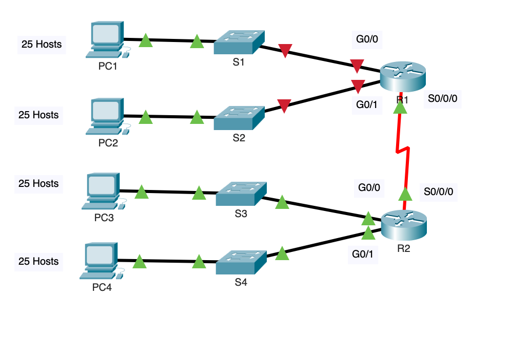

# Situación

En esta actividad, se le asigna la dirección de red 192.168.100.0/24 para que cree una subred y proporcione la asignación de direcciones IP para la red que se muestra en la topología. Cada LAN de la red necesita espacio suficiente como para alojar, como mínimo, 25 direcciones para terminales, el switch y el router. a conexión entre el R1 y el R2 requiere una dirección IP para cada extremo del enlace.

## Parte 1: Diseñe un direccionamiento IP Esquema

### Paso 1: Subre la red 192.168.100.0/24 en el número apropiado de subredes.

#### Preguntas:

a. Según la topología, ¿cuántas subredes se necesitan?

**Se necesitan 5 subredes, 4 serian para los host y una para el enlace WAN**

b. ¿Cuántos bits se deben pedir prestado para admitir la cantidad de subredes en la tabla de topología? 

**Se necesitan pedir prestados mínimo 3 bits para crear 8 subredes**

c. ¿Cuántas subredes se crean?

**Se crean 8 subredes**

d. ¿Cuántas direcciones de host utilizables se crean por subred?

**30 host utilizables**

**Nota**: Si respondió que se necesitaban menos de los 25 hosts requeridos, tomó prestados demasiados bits.

e. Calcule el valor binario de las primeras 5 subredes. Las dos primeras subredes se han hecho por usted.

| Subred | Dirección de red | Bit 7 | Bit 6 | Bit 5 | Bit 4 | Bit 3 | Bit 2 | Bit 1 | Bit 0 |
| ------ | ---------------- | ----- | ----- | ----- | ----- | ----- | ----- | ----- | ----- |
| 0      | 192.168.100.0    | 0     | 0     | 0     | 0     | 0     | 0     | 0     | 0     |
| 1      | 192.168.100.32   | 0     | 0     | 1     | 0     | 0     | 0     | 0     | 0     |
| 2      | 192.168.100.64   | 0     | 1     | 0     | 0     | 0     | 0     | 0     | 0     |
| 3      | 192.168.100.96   | 0     | 1     | 1     | 0     | 0     | 0     | 0     | 0     |
| 4      | 192.168.100.128  | 1     | 0     | 0     | 0     | 0     | 0     | 0     | 0     |

f. Calcule el valor binario y decimal de la nueva máscara de subred.

| Primer octeto                   | Segundo Octeto         | Tercer Octeto         | Máscara Bit 7         | Máscara Bit 6 | Máscara Bit 5 | Máscara Bit 4 | Máscara Bit 3 | Máscara Bit 2 | Máscara Bit 1 | Bit de máscara 0 |
| ------------------------------- | ---------------------- | --------------------- | --------------------- | ------------- | ------------- | ------------- | ------------- | ------------- | ------------- | ---------------- |
| 11111111                        | 11111111               | 11111111              | 1                     | 1             | 1             | 0             | 0             | 0             | 0             | 0                |
| Rango decimal del primer octeto | Segundo octeto decimal | Tercer octeto decimal | Cuarto octeto decimal |               |               |               |               |               |               |                  |
| 255.                            | 255.                   | 255.                  | 224                   |               |               |               |               |               |               |                  |

g. Rellene la **Tabla de subredes**, indicando el valor decimal de todas las subredes disponibles, la primera y la última dirección de host utilizable, y la dirección de broadcast.. Repita hasta que aparezcan todas las direcciones.

**Nota:** Es posible que no utilice todas las filas.

# Tabla de subredes

| Número de subred | Dirección de subred | Primera dirección de host libre | Última dirección de host utilizable | Dirección de difusión | Gateway predeterminado |
| ---------------- | ------------------- | ------------------------------- | ----------------------------------- | --------------------- | ---------------------- |
| **0**            | 192.168.100.0       | 192.168.100.2                   | 192.168.100.30                      | 192.168.100.31        | 192.168.100.1          |
| **1**            | 192.168.100.32      | 192.168.100.34                  | 192.168.100.62                      | 192.168.100.63        | 192.168.100.33         |
| **2**            | 192.168.100.64      | 192.168.100.66                  | 192.168.100.94                      | 192.168.100.95        | 192.168.100.65         |
| **3**            | 192.168.100.96      | 192.168.100.98                  | 192.168.100.126                     | 192.168.100.127       | 192.168.100.97         |
| **4**            | 192.168.100.128     | 192.168.100.130                 | 192.168.100.158                     | 192.168.100.159       | 192.168.100.129        |
| **5**            | 192.168.100.160     | 192.168.100.162                 | 192.168.100.190                     | 192.168.100.191       | 192.168.100.161        |
| **6**            | 192.168.100.192     | 192.168.100.194                 | 192.168.100.222                     | 192.168.100.223       | 192.168.100.193        |
| **7**            | 192.168.100.224     | 192.168.100.226                 | 192.168.100.254                     | 192.168.100.255       | 192.168.100.225        |
| **8**            |                     |                                 |                                     |                       |                        |
| **9**            |                     |                                 |                                     |                       |                        |
| **10**           |                     |                                 |                                     |                       |                        |

Paso 2:

### Asignar las subredes a la red que se muestra en la topología.

a.Asigne la subred0 a la LAN conectada a la interfaz GigabitEthernet 0/0 del R1:

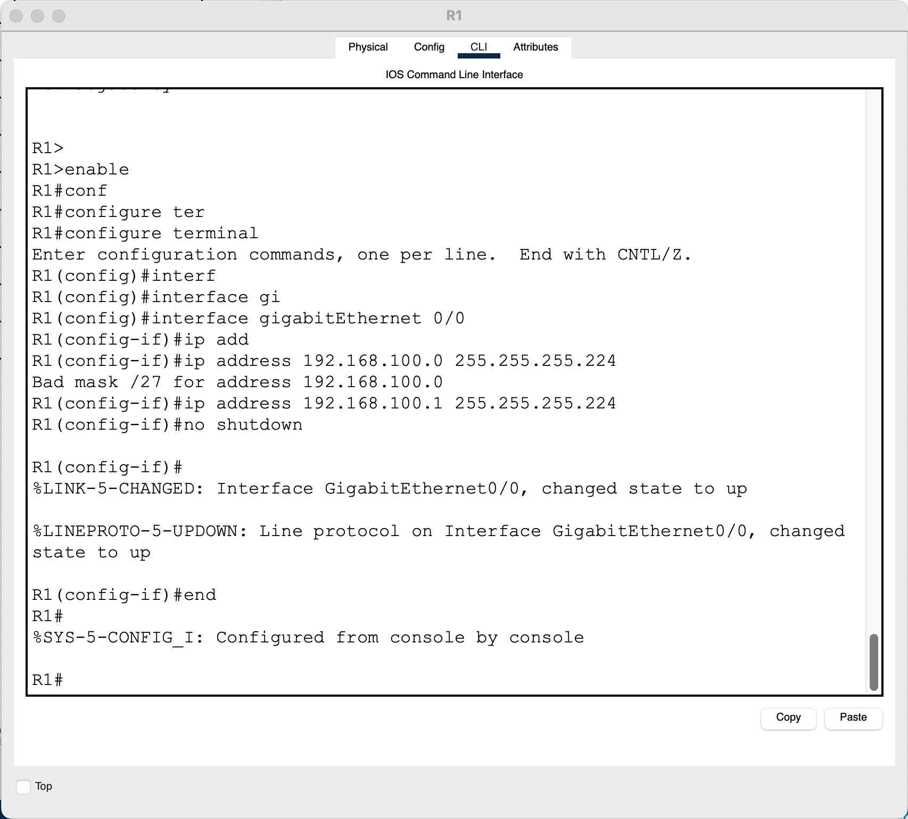

b.Asigne la subred 1 a la LAN conectada a la interfaz GigabitEthernet 0/1 del R1:

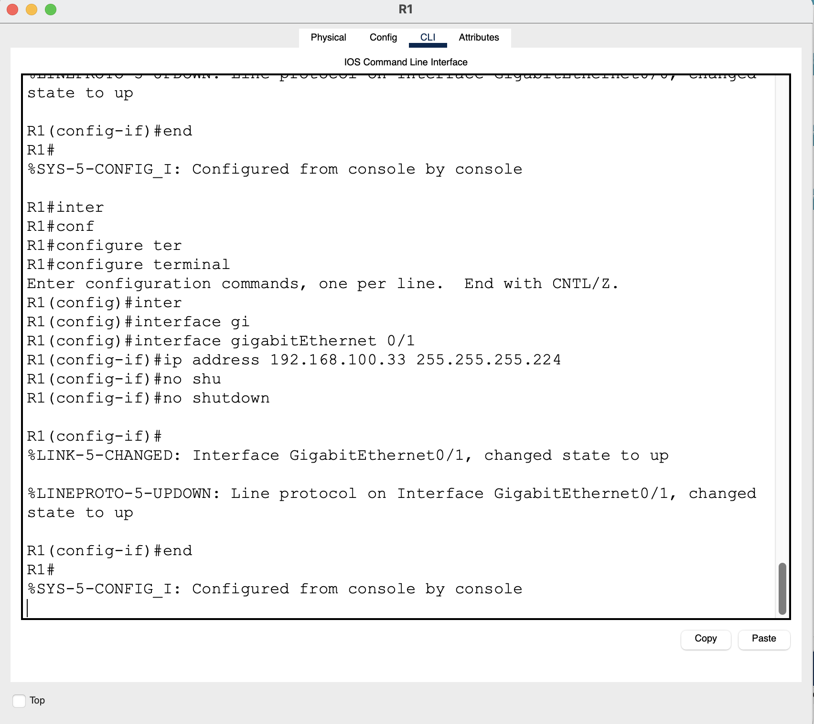
c.Asigne la subred 2 a la LAN conectada a la interfaz GigabitEthernet 0/0 del R2:

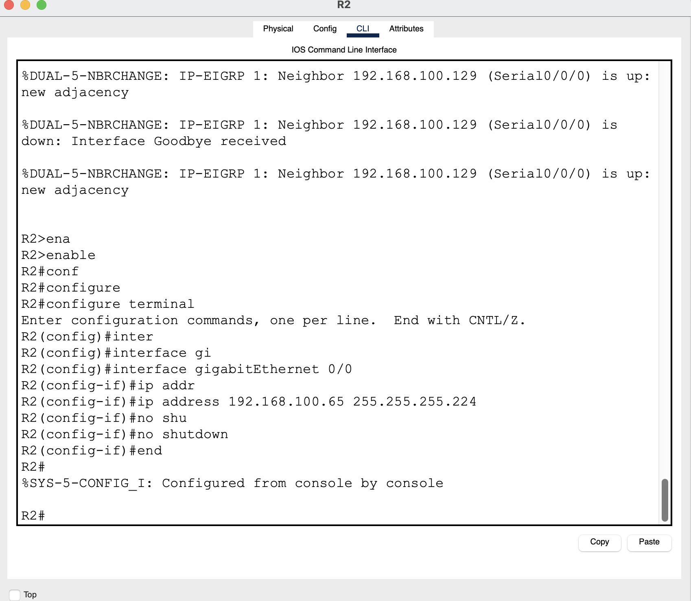

d.Asigne la subred 3 a la LAN conectada a la i nterfaz GigabitEthernet 0/1 del R2:

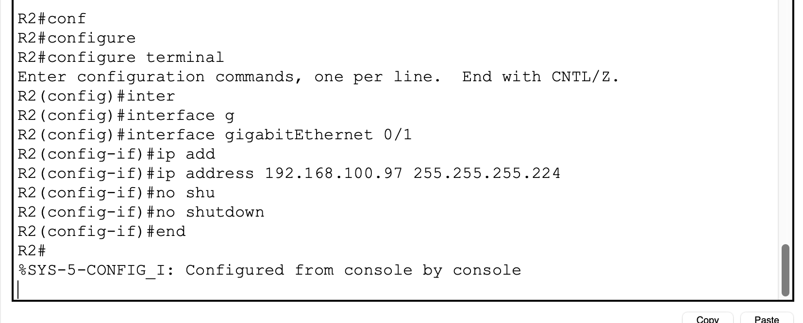

e.Asigne la subred 4 al enlace WAN entre R1 y R2:

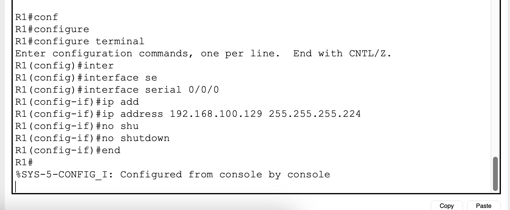

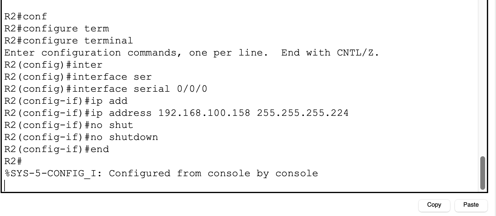

### Documentar el esquema de direccionamiento.

Complete la [tabla de direccionamiento](#tabla-de-asignacion-de-direcciones) con las siguientes pautas:

a.Asigne las primeras direcciones IP utilizables al R1 para los dos enlaces LAN y el enlace WAN.

b.Asigne las primeras direcciones IP utilizables al R2 para los enlaces LAN. Asigne la última dirección IP utilizable al enlace WAN.

c.Asigne las segundas direcciones IP utilizables a los switches.

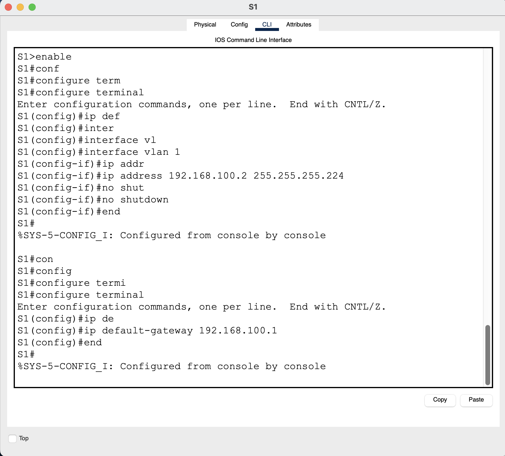

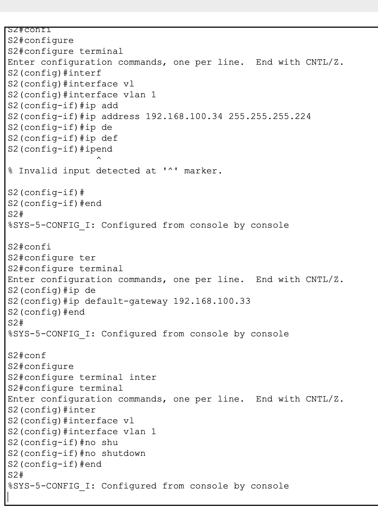

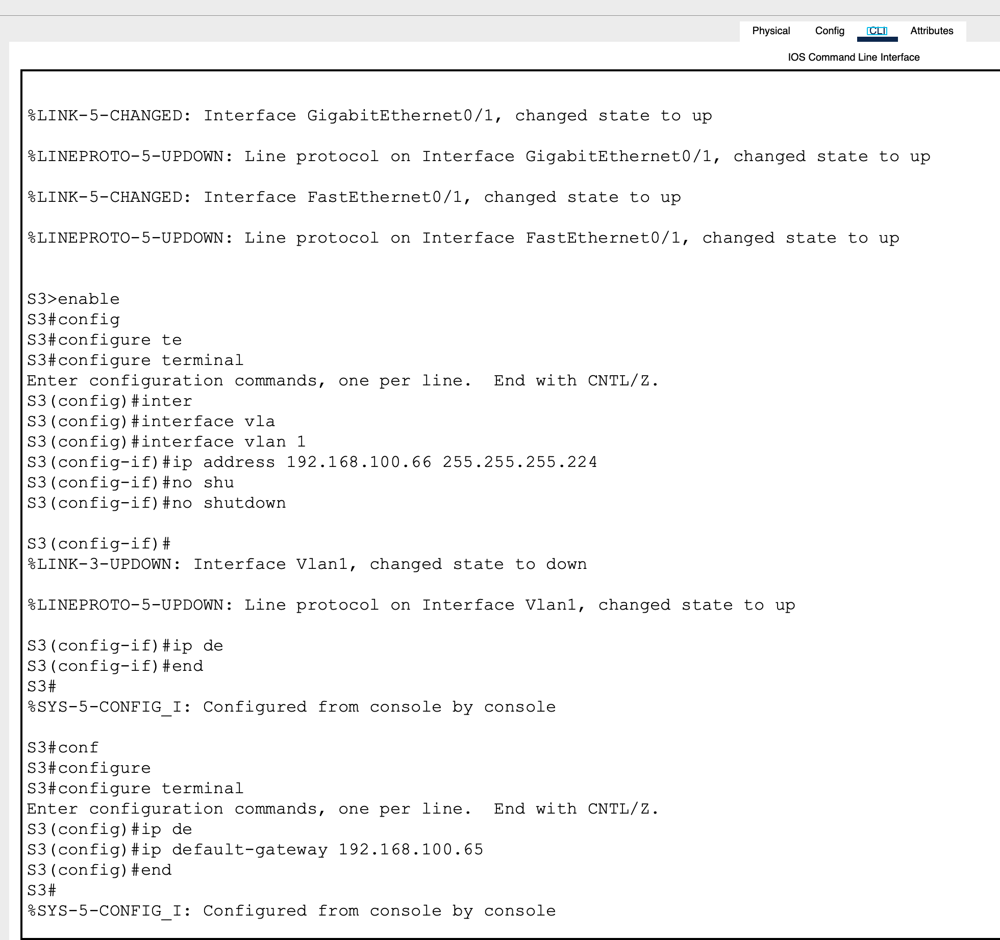

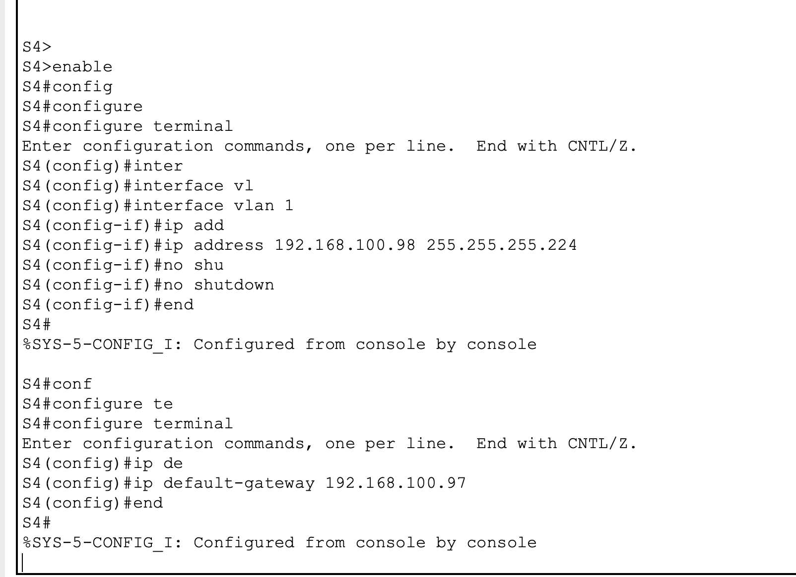

d.Asigne las últimas direcciones IP utilizables a los hosts.

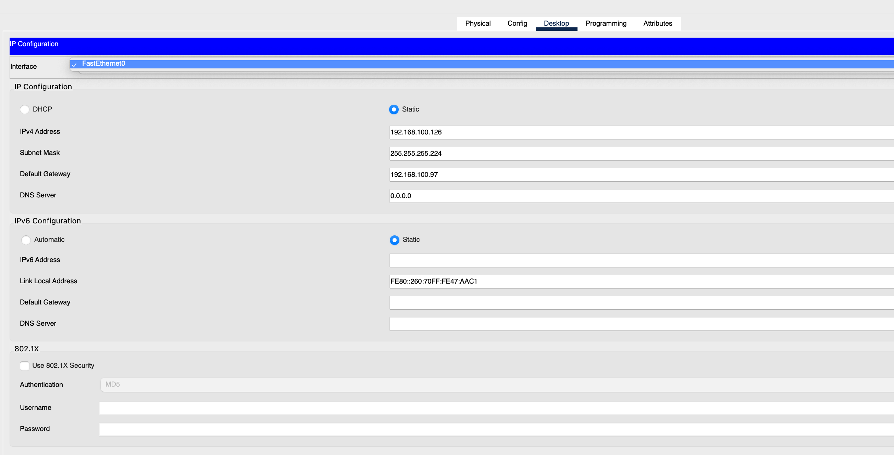

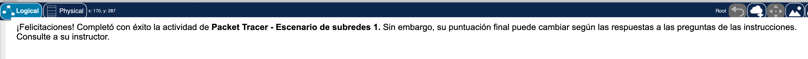

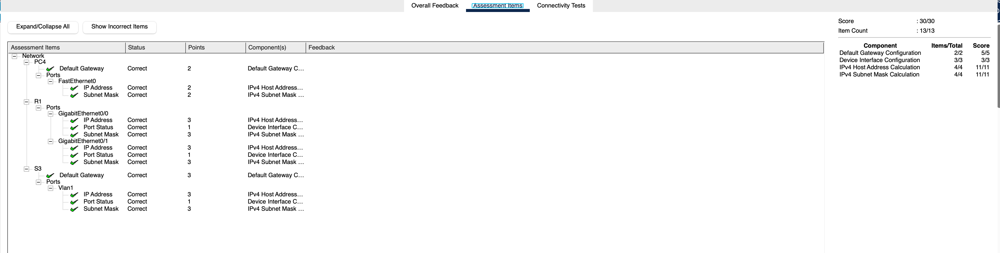