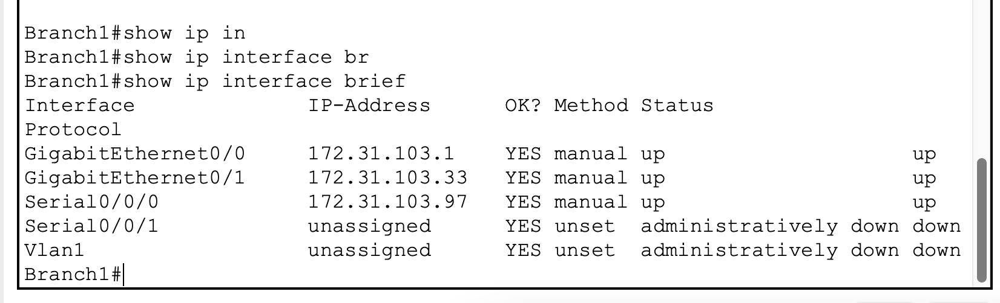
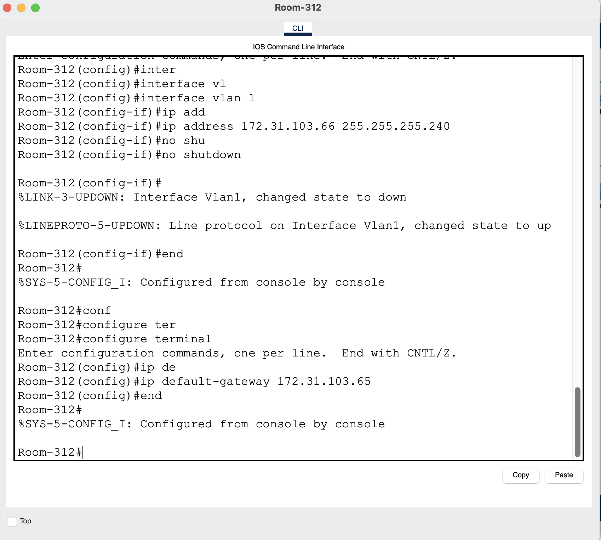
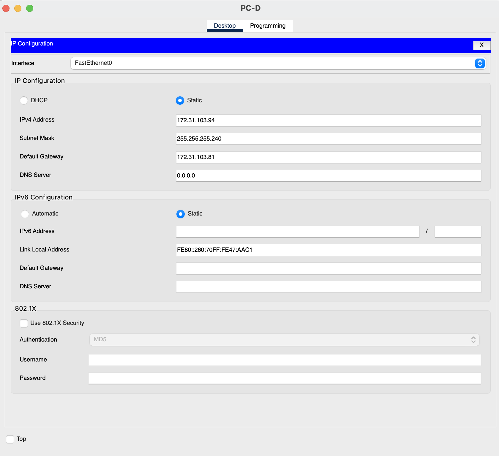
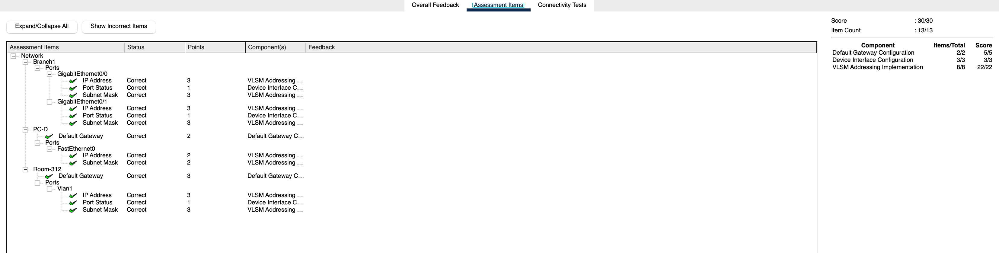

# Packet Tracer - Práctica de Diseño e Implementación de VLSM

|             |          |                   |                     |                        |
| ----------- | -------- | ----------------- | ------------------- | ---------------------- |
| Dispositivo | Interfaz | Dirección IP      | Máscara de subred   | Gateway predeterminado |
| Branch1     | G0/0     | **172.31.103.1**  | **255.255.255.224** | No corresponde         |
| Branch1     | G0/1     | **172.31.103.33** | **255.255.255.224** | No corresponde         |
| Branch1     | S0/0/0   | **172.31.103.97** | **255.255.255.252** | N/D                    |
| Branch2     | G0/0     | **172.31.103.65** | **255.255.255.240** | N/D                    |
| Branch2     | G0/1     | **172.31.103.81** | **255.255.255.240** | N/D                    |
| Branch2     | S0/0/0   | **172.31.103.98** | **255.255.255.252** | N/D                    |
| Room-114    | VLAN 1   | **172.31.103.2**  | **255.255.255.224** | **172.31.103.1**       |
| Room-279    | VLAN 1   | **172.31.103.34** | **255.255.255.224** | **172.31.103.33**      |
| Room-312    | VLAN 1   | **172.31.103.66** | **255.255.255.240** | **172.31.103.65**      |
| Room-407    | VLAN 1   | **172.31.103.82** | **255.255.255.240** | **172.31.103.81**      |
| PC-A        | NIC      | **172.31.103.30** | **255.255.255.224** | **172.31.103.1**       |
| PC-B        | NIC      | **172.31.103.62** | **255.255.255.224** | **172.31.103.33**      |
| PC-C        | NIC      | **172.31.103.78** | **255.255.255.240** | **172.31.103.65**      |
| PC-D        | NIC      | **172.31.103.94** | **255.255.255.240** | **172.31.103.81**      |

# Objetivos

**Parte 1: Examinar los requisitos de la red**

**Parte 2: Diseñar el esquema de direccionamiento VLSM**

**Parte 3: Asigne direcciones IP a los dispositivos y verificar la conectividad**

# Aspectos básicos

En esta actividad, se le da una dirección de red /24 para usar para diseñar un esquema de direccionamiento VLSM. Según un conjunto de requisitos, asignará subredes y direccionamiento, configurará dispositivos y verificará la conectividad.

# Instrucciones

## Parte 1: Examinar los requisitos de red

### Paso 1: Determinar el número de subredes necesarias.

Dividirá en subredes la dirección de red **172.31.103.0/24**. La red tiene los siguientes requisitos:

· **Room-114** LAN requerirá **27** direcciones IP de host

· **Room-279** LAN requerirá **25** direcciones IP de host

· **Room-312** LAN requerirá **14** direcciones IP de host

· **Room-407** LAN requerirá **8** direcciones IP de host

#### Pregunta:

¿Cuántas subredes se necesitan en la topología de red ?

**Se necesitan 5 subredes 4 para los Room y 1 para la conexion entre routers Branch1 y Branch2**

### Paso 2: Determine la información de la máscara de subred para cada subred.

#### Preguntas:

a. Qué máscara de subred acomodará la cantidad de direcciones IP requeridas para **Room-114**?

**/27**

**255.255.255.224**

¿Cuántas direcciones de host utilizables admitirá esta subred?

**30 direcciones utilizables**

b. Qué máscara de subred acomodará la cantidad de direcciones IP requeridas para **Room-279**?

**/27**

**255.255.255.224**

¿Cuántas direcciones de host utilizables admitirá esta subred?

**30 direcciones utilizables**

c. Qué máscara de subred admitirá la cantidad de direcciones IP requeridas para **Room-312**?

**/28**

**255.255.255.240**

¿Cuántas direcciones de host utilizables admitirá esta subred?

**14 direcciones IP utilizables**

d. Qué máscara de subred admitirá la cantidad de direcciones IP requeridas para **Room-407**?

**/28**

**255.255.255.240**

¿Cuántas direcciones de host utilizables admitirá esta subred?

**14 direcciones IP utilizables**

e. ¿Qué máscara de subred admitirá la cantidad de direcciones IP requerida para la conexión entre **Branch1** y **Branch2**?

**/30**

**255.255.255.252**

## Parte 2: Diseñar el esquema de direccionamiento VLSM

### Paso 1: Dividir la red 172.31.103.0/24 según el número de hosts por subred.

a. Utilice la primera subred para admitir la LAN más grande.

b. Utilice la segunda subred para admitir la segunda LAN más grande.

c. Utilice la tercera subred para admitir la tercera LAN más grande.

d. Utilice la cuarta subred para admitir la cuarta LAN más grande.

e. Use Utilice la quinta subred para admitir la conexión entre **Branch1** y **Branch2**.

### Paso 2: Documente las subredes VLSM.

Complete la **Tabla de Subred**, enumerando la descripciones de subred (ejemplo. Room-114 LAN), la cantidad de hosts necesarios, luego la dirección de red para la subred, la primera dirección de host utilizable y la dirección de difusión.

Repita hasta que se incluyan todas las direcciones.

# Tabla de subredes

| Descripción de la subred | Cantidad de hosts necesarios | Dirección de red/CIDR | Primera dirección de host utilizable | Dirección de difusión |
| ------------------------ | ---------------------------- | --------------------- | ------------------------------------ | --------------------- |
| **Room-114 LAN**         | **27**                       | **172.31.103.0/27**   | **172.31.103.1**                     | **172.31.103.31**     |
| **Room-279 LAN**         | **25**                       | **172.31.103.32/27**  | **172.31.103.33**                    | **172.31.103.63**     |
| **Room-312 LAN**         | **14**                       | **172.31.103.64/28**  | **172.31.103.65**                    | **172.31.103.79**     |
| **Room-407 LAN**         | **8**                        | **172.31.103.80/28**  | **172.31.103.81**                    | **172.31.103.95**     |
| **B1 to B2**             | **2**                        | **172.31.103.96/30**  | **172.31.103.97**                    | **172.31.103.99**     |

### Paso 3: Documente el esquema de direccionamiento.

a. Asigne las primeras direcciones IP utilizables a **Branch1** para los dos enlaces LAN y el enlace WAN.

b. Asigne las primeras direcciones IP utilizables a **Branch2** para los dos enlaces LAN. Asigne la última dirección IP utilizable al enlace WAN.

c. Asigne las segundas direcciones IP utilizables a los switches.

d. Asigne las últimas direcciones IP utilizables a los hosts.

## Parte 3: Asignar direcciones IP a los dispositivos y verificar la conectividad

La mayor parte de la asignación de direcciones IP ya está configurada en en esta red. Implemente los siguientes pasos para completar la configuración del direccionamiento.

### Paso 1: Configure el direccionamiento IP en las interfaces LAN del router Branch1.

### Paso 2: Configure el direccionamiento IP en Room-312, cambie incluyendo la default gateway.

### Paso 3: Configure el direccionamiento IP en PC-D, incluida la puerta de enlace predeterminada.

